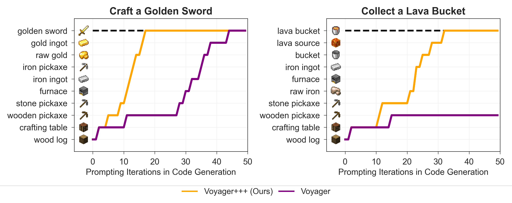

# Voyager+++: Enhanced Task Decomposition For Open-Ended LLM Agents
<div align="center">

[](https://github.com/MineDojo/Voyager)
______________________________________________________________________

王凱右 (R13922022) 蔡佾家 (R13922090) 胡凱騰 (R13922090) 江德偉 (D10725001)



</div>
We introduce Voyager+++, a novel hierarchical multi-agent framework designed to enhance open-ended task completion in Minecraft. Built upon the foundation of the Voyager project, Voyager+++ integrates a Decomposer Multi-agent System for stable and coherent subtask planning, and introduces improved agent modules—Action Agent+, Critic Agent+, and Curriculum Agent+—to boost decision-making precision, feedback evaluation quality, and skill progression. Across four crafting tasks, Voyager+++ reduces the required iterations by up to 2.5× (e.g., 18.33 vs. 46 for crafting a golden sword), and succeeds in tasks where Voyager fails. Furthermore, it accelerates learning efficiency by avoiding redundant low-level tasks and adopting batch resource collection, resulting in a 2× faster skill expansion, confirming its effectiveness in both execution and learning efficiency.

# Installation

The installation process for Voyager+++ is identical to that of the original [Voyager project](https://github.com/MineDojo/Voyager). 
Therefore, we omit the installation section here. Please refer to the official Voyager repository for installation instructions.

# Run Voyager+++ for a specific task with a learned skill library
Voyager+++ uses OpenAI's GPT-4o as the language model. You need to have an OpenAI API key to use Voyager+++. You can get one from [here](https://platform.openai.com/account/api-keys).

After the installation process, you can run Voyager+++ for a specific task.
First, you should run task decomposition. 
You can choose one of the decompostion method.
```python
# Run task decomposition
task = "YOUR TASK" # e.g. "Craft a diamond pickaxe"

# Method 1. Run task decomposition of original Voyager
sub_goals = voyager.decompose_task(task=task)

# Method 2. Run task decomposition of Voyager+++
decompose_agent = DecomposeAgent(openai_api_key=openai_api_key)
sub_goals = decompose_agent.decompose(task)
    
```
Finally, you can run the sub-goals with the learned skill library:
```python
voyager.inference(sub_goals=sub_goals)
```
You can refer to ```main.py``` for a example and original [Voyager project](https://github.com/MineDojo/Voyager) for more detail.
```bash
python main.py
```


# Run Voyager+++ for learning 

```python
from voyager import Voyager

voyager = Voyager(
    mc_port=mc_port,
    env_wait_ticks=env_wait_ticks,
    openai_api_key=openai_api_key,
    ckpt_dir="./run/learn", 
    resume=False, 
)


# start lifelong learning

voyager.learn()

```


# Paper and Citation

Our study is based on modifications to the [Voyager project](https://github.com/MineDojo/Voyager).

```bibtex
@article{wang2023voyager,
  title   = {Voyager: An Open-Ended Embodied Agent with Large Language Models},
  author  = {Guanzhi Wang and Yuqi Xie and Yunfan Jiang and Ajay Mandlekar and Chaowei Xiao and Yuke Zhu and Linxi Fan and Anima Anandkumar},
  year    = {2023},
  journal = {arXiv preprint arXiv: Arxiv-2305.16291}
}
```
